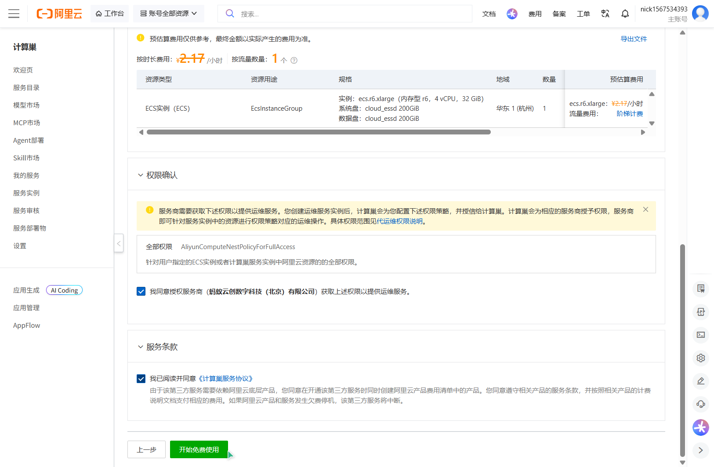
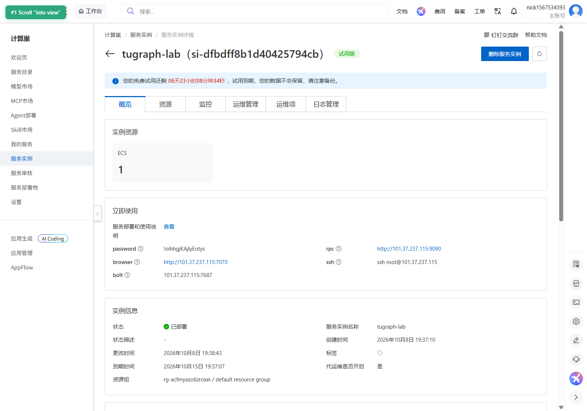
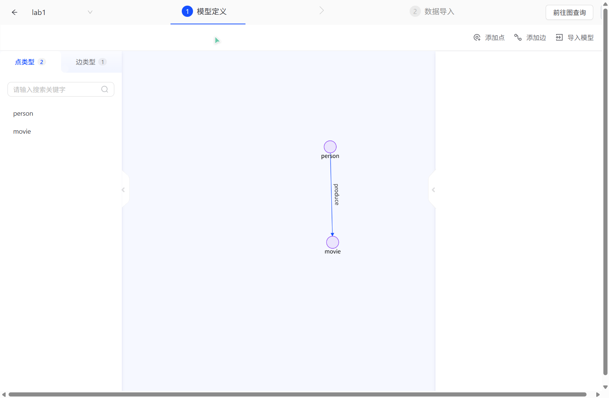
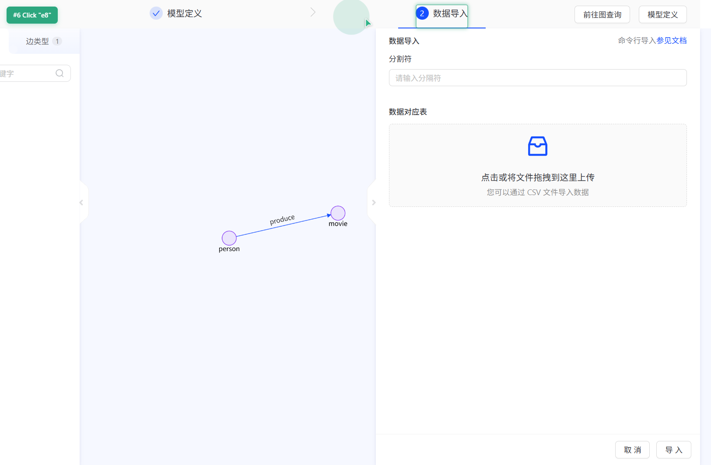
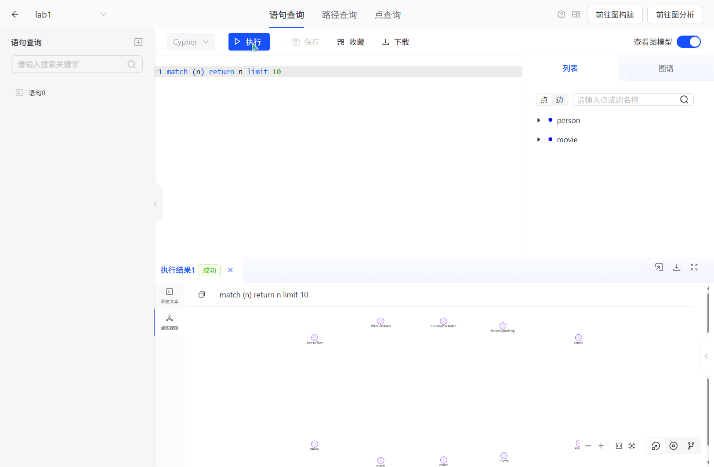
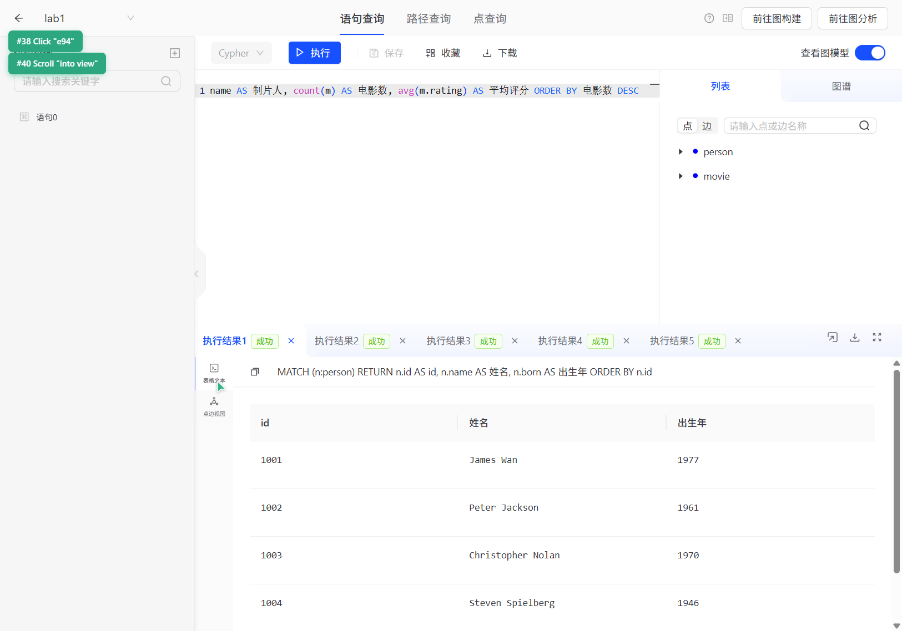
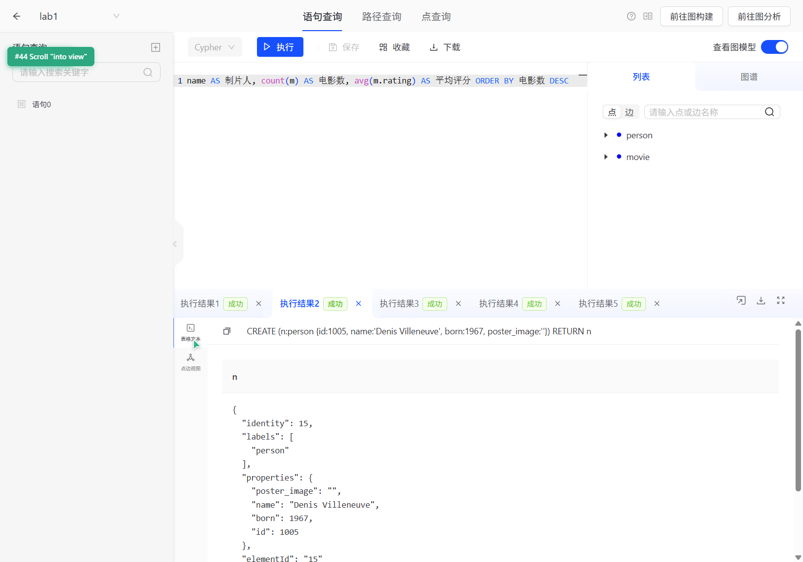
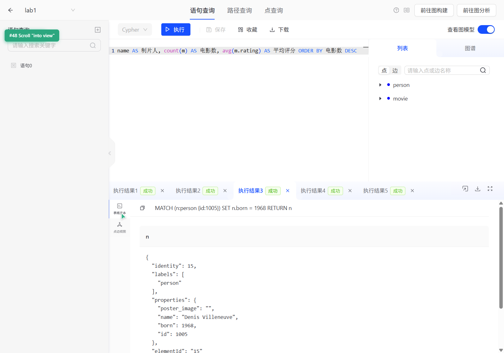
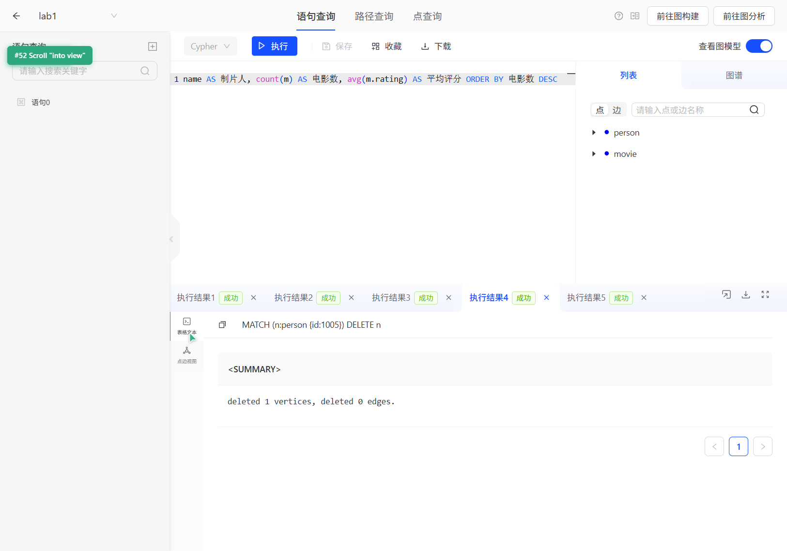
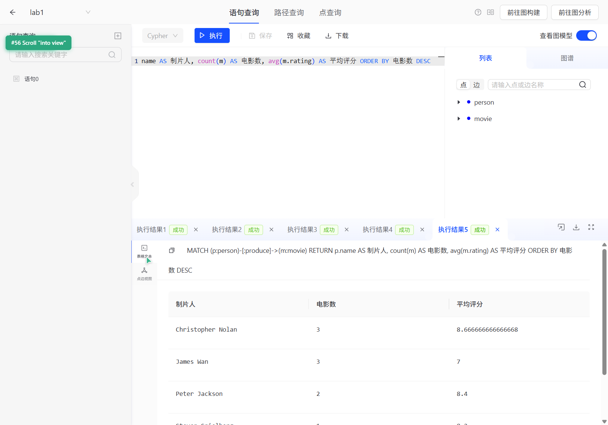

# 专业综合实践 作业1：TuGraph 图数据库实验报告

## 一、实验目标

1. 成功启动 TuGraph 平台，描述安装/部署步骤，并展示系统登录截图；
2. 完成图模型建立、数据导入、增删改查，并截图展示运行结果；
3. 自行设计一个聚合查询的例子，并截图展示运行结果；
4. 通过 GitHub 提交本报告。

## 二、实验环境

| 项目 | 内容 |
| --- | --- |
| 图数据库 | TuGraph 社区版（阿里云计算巢「TuGraph 高性能图数据库 试用版」服务实例） |
| 部署方式 | 阿里云计算巢（Compute Nest）免费试用，一键部署到 ECS |
| 规格 | ecs.r6.xlarge（内存型 r6，4 vCPU / 32 GiB / ESSD 200 GiB） |
| 地域/可用区 | 华东1（杭州） / cn-hangzhou-j |
| 操作系统 | Linux（容器化部署） |
| Web 控制台 | `http://101.37.237.115:7070`（TuGraph Browser） |
| Bolt 端口 | `101.37.237.115:7687` |
| RPC 端口 | `http://101.37.237.115:9090` |
| 客户端 | Python 3.10 + neo4j 官方驱动（Bolt 协议，兼容 Neo4j） |

> 说明：本实例为计算巢**免费试用**实例，试用期 7 天（2026-10-08 创建，2026-10-15 到期自动销毁）。文中涉及的口令均为该临时试用实例的口令。

## 三、安装 / 部署步骤

TuGraph 官方现在不再提供自助注册的云控制台，官方推荐的免费云端方案是**阿里云计算巢上的 TuGraph 社区版免费试用**。完整步骤如下：

1. **准备阿里云账号**：使用阿里云账号登录 `https://www.aliyun.com`，并完成实名认证。
2. **进入部署入口**：打开计算巢控制台，搜索「TuGraph」，或直接使用官方部署链接进入「TuGraph 高性能图数据库」服务实例创建页。
3. **选择版本与配置**：
   - 服务实例名称：`tugraph-lab`；
   - 地域：华东1（杭州）；
   - 付费类型：**按量付费**（免费试用阶段费用为 0）；
   - 实例类型：套餐一 `ecs.r6.xlarge`（4 vCPU / 32 GiB）；
   - 部署区域：可用区 J（cn-hangzhou-j）；
   - 设置**实例密码**（8~30 位，含大写字母、小写字母、数字、特殊符号中至少三类）。
4. **确认订单**：勾选「权限确认」与《计算巢服务协议》，点击**开始免费试用**。
5. **等待部署**：约 2 分钟后部署完成，服务实例状态显示为「已部署」。
6. **获取访问信息**：在服务实例详情页可获取 `browser / rpc / ssh / bolt` 四种访问方式，以及 admin 用户密码。

部署与访问信息截图：





## 四、系统登录

1. 浏览器访问 Web 控制台地址 `http://101.37.237.115:7070`，进入登录页；
2. 填写数据库地址 `101.37.237.115:7687`（Bolt 地址）；
3. 账号 `admin`，密码为服务实例详情页展示的 admin 密码；
4. 点击「登录」，进入 TuGraph 首页（图项目列表）。

系统登录截图：


## 五、模型建立

本实验以「影视-主创」关系为主题，共建立 **2 个点标签 + 1 个边标签**，做成一张子图 `lab1`：

| 标签 | 类型 | 说明 | 属性 |
| --- | --- | --- | --- |
| `person` | 点（实体） | 主创人员（制片人/导演） | `id`(INT64,主键)、`name`(STRING)、`born`(INT64)、`poster_image`(STRING) |
| `movie` | 点（实体） | 影片 | `id`(INT64,主键)、`title`(STRING)、`year`(INT64)、`rating`(DOUBLE) |
| `produce` | 边（关系） | person 制作 / 出品 movie | 起点 `person` → 终点 `movie` |

建模方式：在 TuGraph Browser 的「图构建 → 模型定义」中定义点/边类型；也可由命令行建模（`CALL db.createVertexLabelByJson(...)`）。建模完成后的图模型如下（点类型 2 个、边类型 1 个）：



## 六、数据导入

数据导入使用 TuGraph Browser 的「图构建 → 数据导入」功能（支持按列分隔符上传 CSV 文件并映射到点/边标签的属性）：



同时，也可以使用官方 **Bolt 协议**批量导入数据（与 `lgraph_import`/`ceshi_bolt.py` 等效）。本实验使用 Python + neo4j 驱动通过 Bolt 端口批量写入，导入脚本见 [`scripts/tugraph_lab1.py`](scripts/tugraph_lab1.py)。

导入结果统计：

| 类别 | 数量 |
| --- | --- |
| `person` 点 | 4 |
| `movie` 点 | 9 |
| `produce` 边 | 9 |

导入后在图查询页执行 `match (n) return n limit 10`，可看到图中已写入 person 与 movie 节点：



## 七、增删改查

| 操作 | Cypher 语句 | 说明 |
| --- | --- | --- |
| **查** | `MATCH (n:person) RETURN n.id AS id, n.name AS 姓名, n.born AS 出生年 ORDER BY n.id` | 查询全部主创人员 |
| **增** | `CREATE (n:person {id:1005, name:'Denis Villeneuve', born:1967, poster_image:''}) RETURN n` | 新增一位主创 |
| **改** | `MATCH (n:person {id:1005}) SET n.born = 1968 RETURN n` | 修改出生年份 |
| **删** | `MATCH (n:person {id:1005}) DELETE n` | 删除该节点 |

运行结果截图：









## 八、聚合查询（自设计）

设计思路：以「制片人」为分组维度，统计其制作的电影数量与平均评分，并对结果排序、过滤，用于评价不同主创的产出与口碑。

**例1：统计每位制片人制作的电影数量与平均评分，按电影数降序**

```cypher
MATCH (p:person)-[:produce]->(m:movie)
RETURN p.name AS 制片人, count(m) AS 电影数, avg(m.rating) AS 平均评分
ORDER BY 电影数 DESC, 平均评分 DESC
```

运行结果：

| 制片人 | 电影数 | 平均评分 |
| --- | --- | --- |
| Christopher Nolan | 3 | 8.67 |
| James Wan | 3 | 7.00 |
| Peter Jackson | 2 | 8.40 |
| Steven Spielberg | 1 | 8.20 |



**例2：使用 WITH 进行多段聚合与过滤——找出制作电影数 ≥ 2 且平均评分 > 8 的制片人**

```cypher
MATCH (p:person)-[:produce]->(m:movie)
WITH p, count(m) AS 电影数, avg(m.rating) AS 平均评分
WHERE 电影数 >= 2 AND 平均评分 > 8
RETURN p.name AS 制片人, 电影数, 平均评分
ORDER BY 平均评分 DESC
```

运行结果：Christopher Nolan（3 部，8.67）、Peter Jackson（2 部，8.40）。

**例3：统计各年份的电影数量分布**

```cypher
MATCH (m:movie)
RETURN m.year AS 年份, count(m) AS 数量
ORDER BY 年份
```

> 说明：Cypher 中没有显式的 `GROUP BY` 关键字，分组是隐式的——在 `RETURN`/`WITH` 中只要出现聚合函数（如 `count()`、`avg()`），其余非聚合字段即自动成为分组键。

## 九、实验总结

1. 通过阿里云计算巢「一键部署」了 TuGraph 社区版服务实例，验证了官方推荐的免费试用路径（免自购云主机、免运维），并在 Web 控制台完成登录；
2. 使用属性图模型完成了「影人关系图」的建模（2 点类型 + 1 边类型），并通过 Web 端 CSV 导入与 Bolt 协议两种方式完成数据导入；
3. 使用 Cypher 完成了增删改查操作，验证了 `CREATE` / `MATCH` / `SET` / `DELETE` 的用法；
4. 自行设计并实现了聚合查询，掌握了 Cypher 隐式分组、`WITH` 多段聚合与 `ORDER BY` 排序的用法。

## 十、目录结构

```
.
├── README.md                     # 本实验报告
├── screenshots/                  # 运行结果截图
│   ├── deploy-01-confirm-order.png
│   ├── deploy-02-instance-detail.png
│   ├── deploy-03-tugraph-login.png
│   ├── deploy-04-tugraph-home.png
│   ├── model-01-model-defined.png
│   ├── model-02-data-import.png
│   ├── query-01-graph.png
│   ├── crud-01-select.png
│   ├── crud-02-create.png
│   ├── crud-03-update.png
│   ├── crud-04-delete.png
│   └── agg-01-aggregation.png
└── scripts/
    └── tugraph_lab1.py           # Bolt 协议批量建模/导数据/增删改查/聚合脚本
```
